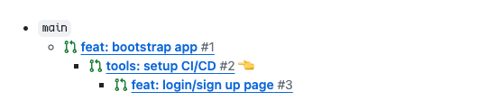

<p align="center">
  <picture>
    <source media="(prefers-color-scheme: light)" srcset="https://raw.githubusercontent.com/git-town/git-town/main/website/src/logo.svg">
    <source media="(prefers-color-scheme: dark)" srcset="https://raw.githubusercontent.com/git-town/git-town/main/website/src/logo-dark.svg">
    
  </picture>
</p>

# Git Town Action V1

This action visualizes your stacked changes when proposing pull requests on GitHub:



This allows you to easily see all related PRs for a given pull request, where
you are in the stack, as well as navigate between PRs in a stack.

It is designed to work out of the box with [Git Town](https://github.com/git-town/git-town) v12+,
but also supports previous versions via [manual configuration](#manual-configuration).

## What's New

Please refer to the [release page](https://github.com/git-town/action/releases/latest) for
the latest release notes.

## Getting Started

### Create the GitHub Actions Workflow File

Create a workflow file called `git-town.yml` under `.github/workflows` with the following
contents:

```yaml
name: Git Town

on:
  pull_request:
    branches:
      - '**'

jobs:
  git-town:
    name: Display the branch stack
    runs-on: ubuntu-latest

    permissions:
      contents: read
      pull-requests: write

    steps:
      - uses: actions/checkout@v4
      - uses: git-town/action@v1
```

Once this workflow is committed, the action will visualize your stacked changes
whenever a pull request is created or updated. It also will automatically read
your `.git-branches.toml` file to determine the main and perennial branches for
your repository.

### Modify the Pull Request Template

By default, this action will append the visualization to the bottom of the PR description.
If you are using a [pull request template](https://docs.github.com/en/communities/using-templates-to-encourage-useful-issues-and-pull-requests/creating-a-pull-request-template-for-your-repository),
you can specify the location of the visualization in the template by adding a [HTML comment](https://docs.github.com/en/get-started/writing-on-github/getting-started-with-writing-and-formatting-on-github/basic-writing-and-formatting-syntax#hiding-content-with-comments)
that contains `branch-stack` inside of it:

```md
## Stack

<!-- branch-stack -->

## Checklist

[ ] Foo
[ ] Bar
[ ] Baz
```

This action will look for this comment and insert the visualization underneath the comment
when it runs. It will also leave behind the comment, so that the next time it runs, it will
be able to use it again to update the visualization:

```md
## Stack

<!-- branch-stack --> 👈 Still there!

- `main`
  - \#1 :point_left:
    - \#2

## Checklist

[ ] Foo
[ ] Bar
[ ] Baz
```

> [!WARNING]
> Be careful not to add content between the comment and the
> visualization, as this action will replace that content each time it
> updates your PR. Adding content above the tag, or below the list is
> safe though!

### Manual Configuration

If you are using Git Town v11 and below, or are setting up this action for a repository
that doesn't have a `.git-branches.toml`, you will need to tell this action what the
main branch and perennial branches are for your repository.

#### Main Branch

The main branch is the default parent branch for new feature branches, and can be
specified using the `main-branch` input:

```yaml
- uses: git-town/action@v1
  with:
    main-branch: 'main'
```

This action will default to your repository's default branch, which it fetches via
the GitHub REST API.

#### Perennial Branches

Perennial branches are long lived branches and are never shipped.

There are two ways to specify perennial branches: explicitly or via regex. This can
be done with the `perennial-branches` and `perennial-regex` inputs respectively:

```yaml
- uses: git-town/action@v1
  with:
    perennial-branches: |
      dev
      staging
      prod
    perennial-regex: '^release-.*$'
```

Both inputs can be used at the same time. This action will merge the perennial
branches given into a single, de-duplicated list.

#### Skip Single Stacks

If you don't want the stack description to appear on pull requests which are not part of a stack, you can add `skip-single-stacks: true` to the job.

This skips all pull requests which point to a perennial branch and have no children pull requests pointing to it.

```yaml
- uses: git-town/action@v1
  with:
    perennial-branches: |
      dev
      staging
      prod
    skip-single-stacks: true
```

## License

The scripts and documentation in this project are released under the [MIT License](LICENSE).
